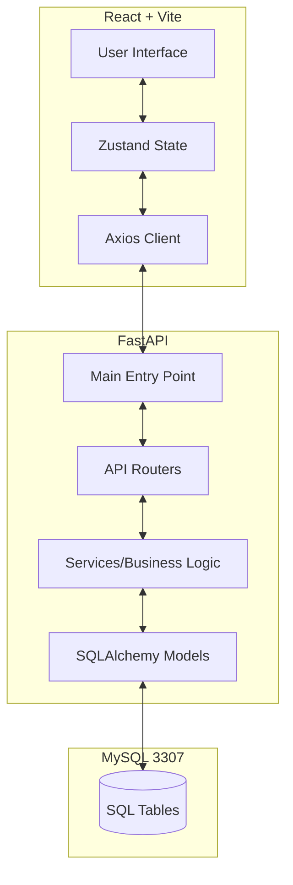
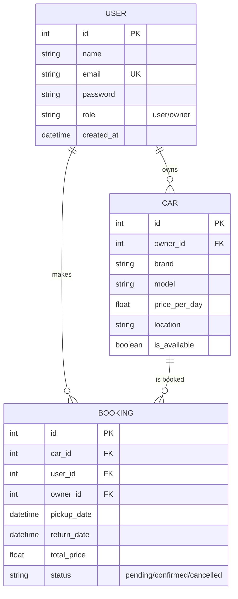

# 🚗 Car Rental Management System

A premium, full-stack car rental platform. This system connects car owners with potential renters through a modern, high-performance interface and a scalable backend.

---

## 🏗️ System Architecture

The project follows a decoupled **Frontend/Backend** architecture to ensure performance, scalability, and maintainability.

### 🧬 High-Level Diagram



---

## 🗄️ Database Schema & Relations

The database uses **SQLAlchemy** to manage relationships between Users, Cars, and Bookings.

### � Entity Relationship Diagram



### 🔗 Key Relationships

- **User ↔ Car**: One user (owner) can have multiple cars.
- **User ↔ Booking**: One user (renter) can have multiple bookings.
- **Car ↔ Booking**: One car can be associated with multiple booking records over time.

---

## 🛠️ Technology Stack

### **Frontend**

- **Framework**: [React 19](https://react.dev/)
- **Build Tool**: [Vite](https://vitejs.dev/) - Fast development and optimized builds.
- **State Management**: [Zustand](https://github.com/pmndrs/zustand) - Minimalist and fast state handling.
- **Styling**: **Vanilla CSS** with a custom design system based on glassmorphism and fluid animations.
- **Routing**: [React Router DOM 7](https://reactrouter.com/) - Handles nested paths and protected dashboard routes.
- **Icons**: [FontAwesome](https://fontawesome.com/) & [React Icons](https://react-icons.github.io/react-icons/).

### **Backend**

- **Framework**: [FastAPI](https://fastapi.tiangolo.com/) - High performance, asynchronous Python framework.
- **ORM**: [SQLAlchemy](https://www.sqlalchemy.org/) - Robust SQL toolkit and Object Relational Mapper.
- **Database**: **MySQL** (configured on port `3307`).
- **Drivers**: `PyMySQL` & `cryptography` for secure communication.
- **Env Management**: `python-dotenv` for managing sensitive credentials.

---

## 🔗 API Methods Analysis (Frontend Sync)

The backend provides specific endpoints designed to meet the needs of the frontend components.

| Component          | Method  | Endpoint           | Description                                       |
| :----------------- | :------ | :----------------- | :------------------------------------------------ |
| **AuthService**    | `POST`  | `/auth/register`   | Create a new account with role (user/owner).      |
| **AuthService**    | `POST`  | `/auth/login`      | JWT Authentication & user profile retrieval.      |
| **CarList**        | `GET`   | `/cars`            | Fetch all cars for the search and home pages.     |
| **CarDetails**     | `GET`   | `/cars/{id}`       | Get technical specs and availability for one car. |
| **OwnerDashboard** | `GET`   | `/owner/dashboard` | Aggregated revenue and activity stats.            |
| **ManageCars**     | `POST`  | `/cars`            | [Owner] Add a new car with image upload.          |
| **MyBookings**     | `GET`   | `/my-bookings`     | List of reservations made by the current user.    |
| **ManageBookings** | `PATCH` | `/bookings/{id}`   | [Owner] Accept or decline a booking request.      |

---

## � Installation & Launch

### Backend

```bash
cd backend
python -m venv venv
.\venv\Scripts\activate
pip install -r requirements.txt
# Ensure your MySQL is running on 3307 and car_rental_db exists
uvicorn app.main:app --reload
```

### Frontend

```bash
cd frontend
npm install
npm run dev
```

---

## � Folder Structure (MVC Architecture)

```bash
backend/
├── app/
│   ├── api/        # Routers (endpoints)
│   ├── core/       # DB Config & Security
│   ├── models/     # SQLAlchemy Database Models
│   ├── schemas/    # Pydantic validation schemas
│   ├── services/   # Business logic
│   └── main.py     # App entry point
└── .env            # Configuration
```
